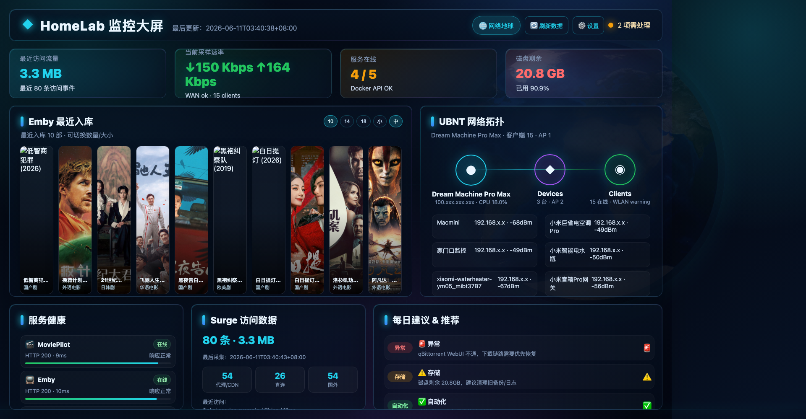
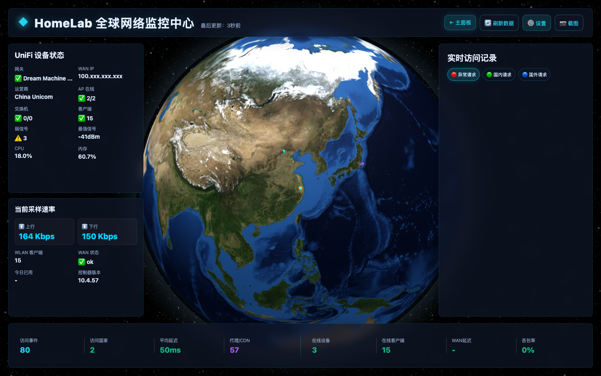
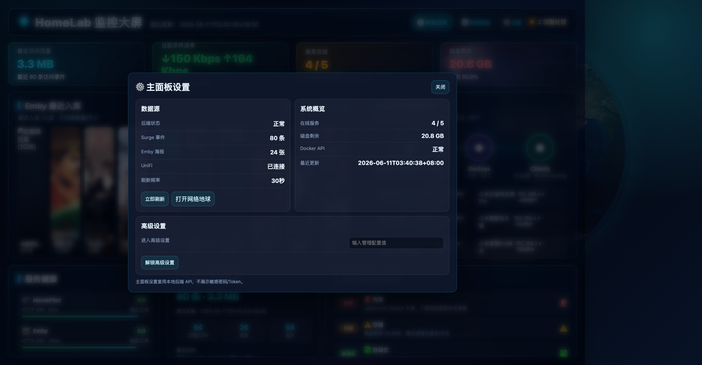

# HomeLab Dashboard

一个适合家庭服务器 / HomeLab 使用的监控大屏，包含：

- 主面板：服务健康、UniFi/UBNT 拓扑、Emby 最近入库海报墙、Surge 访问统计、每日建议
- 3D 网络地球：Surge 访问飞线、UniFi 网络状态、筛选、设置面板、高级设置
- Docker 一键运行
- 配置与敏感信息外置，不需要把密码提交到 GitHub

> 默认访问地址：`http://127.0.0.1:8765/public/index.html`

---


## 效果预览

### 主面板



### 3D 网络地球



### 设置面板



---

## 快速开始：Docker Compose

### 1. 克隆项目

```bash
git clone https://github.com/<your-name>/homelab-dashboard.git
cd homelab-dashboard
```

### 2. 创建配置

```bash
cp .env.example .env
cp config.example.json config/config.json
```

编辑 `.env`：

```bash
DASHBOARD_ADMIN_PASSWORD=请改成你自己的管理密码
SURGE_API_TOKEN=你的 Surge token，可留空
UBNT_USERNAME=你的 UniFi 用户名，可留空
UBNT_PASSWORD=你的 UniFi 密码，可留空
MEDIA_PATH=/你的媒体库路径
```

编辑 `config/config.json`：

- 修改各服务 URL
- 修改容器名称
- 修改 UniFi 控制器地址
- 修改家庭坐标
- 如果不用 Surge / UniFi，可以把对应 `enabled` 改成 `false`

### 3. 启动

```bash
docker compose up -d --build
```

打开：

```text
http://127.0.0.1:8765/public/index.html
```

3D 网络地球：

```text
http://127.0.0.1:8765/public/globe/index.html
```

---

## Docker 参数说明

### `.env`

| 变量 | 说明 | 默认 |
|---|---|---|
| `DASHBOARD_PORT` | Web 端口 | `8765` |
| `DASHBOARD_ADMIN_PASSWORD` | 高级设置密码 | `change-me-please` |
| `STATUS_INTERVAL` | 主状态采集间隔秒数 | `30` |
| `SURGE_INTERVAL` | Surge 请求采集间隔秒数 | `5` |
| `SURGE_API_TOKEN` | Surge External Controller Token | 空 |
| `UBNT_USERNAME` | UniFi 用户名 | 空 |
| `UBNT_PASSWORD` | UniFi 密码 | 空 |
| `MEDIA_PATH` | 媒体库路径，用于 Emby 海报墙 | `./media` |

### Volumes

```yaml
- ./config:/config
- ./data:/app/data
- ${MEDIA_PATH:-./media}:/media:ro
- /var/run/docker.sock:/var/run/docker.sock:ro
```

说明：

- `/config/config.json`：运行配置
- `/app/data`：采集生成的数据
- `/media`：媒体库，只读挂载，用于扫描 `poster.jpg/folder.jpg/cover.jpg`
- `/var/run/docker.sock`：可选，用于读取本机 Docker 容器状态

---

## 配置说明

### 服务健康

在 `config/config.json`：

```json
"services": {
  "emby": {
    "name": "Emby",
    "url": "http://host.docker.internal:8096",
    "container": "emby-server"
  }
}
```

- `url`：服务 Web 地址
- `container`：Docker 容器名；如果不需要检查容器状态可以填 `null`

### Surge

```json
"surge": {
  "enabled": true,
  "baseUrl": "http://host.docker.internal:9091",
  "tokenEnv": "SURGE_API_TOKEN",
  "maxEvents": 80
}
```

注意：Token 放到 `.env` 的 `SURGE_API_TOKEN`，不要写进 `config.json`。

### UniFi / UBNT

```json
"ubnt": {
  "enabled": true,
  "baseUrl": "https://192.168.1.1",
  "site": "default",
  "usernameEnv": "UBNT_USERNAME",
  "passwordEnv": "UBNT_PASSWORD"
}
```

用户名和密码放到 `.env`：

```bash
UBNT_USERNAME=xxx
UBNT_PASSWORD=xxx
```

不要提交真实密码。

### Emby 最近入库海报墙

海报墙不直接调用 Emby API，而是扫描媒体库里的图片：

- `poster.jpg`
- `poster.png`
- `folder.jpg`
- `cover.jpg`

Docker 运行时挂载：

```bash
MEDIA_PATH=/your/media/path
```

页面会通过本地 API：

```text
/api/emby/recent
/api/media/poster
```

安全地加载海报，不暴露主机路径。

---

## 本地非 Docker 运行

```bash
cp config.example.json config.json
export DASHBOARD_ADMIN_PASSWORD='your-password'
export SURGE_API_TOKEN='your-surge-token'
export UBNT_USERNAME='your-unifi-username'
export UBNT_PASSWORD='your-unifi-password'
bash scripts/start_dashboard.sh
```

访问：

```text
http://127.0.0.1:8765/public/index.html
```

---

## 上传 GitHub 前必须确认

不要上传这些文件：

- `config.json`
- `.env`
- `data/status.json`
- `data/network_events.json`
- `data/geoip_cache.json`
- 各种 `*-bak-*` 备份文件
- 任何包含 Token / 密码 / 内网真实信息的文件

项目已提供 `.gitignore` 排除这些文件。

建议上传前执行：

```bash
git status --short
```

确认没有：

```text
config.json
.env
data/*.json
```

---

## 发布到 GitHub

```bash
git init
git add .
git status --short
git commit -m "Initial HomeLab Dashboard"
git branch -M main
git remote add origin https://github.com/<your-name>/homelab-dashboard.git
git push -u origin main
```

如果你想让朋友直接拉镜像使用，可以后续配置 GitHub Actions 自动构建 Docker 镜像到 GHCR。


---

## 可选：发布 Docker 镜像到 GHCR

项目内置 GitHub Actions：

```text
.github/workflows/docker-ghcr.yml
```

推送到 `main` 后会自动构建：

```text
ghcr.io/<your-name>/homelab-dashboard:latest
```

朋友可以这样使用：

```yaml
services:
  homelab-dashboard:
    image: ghcr.io/<your-name>/homelab-dashboard:latest
    container_name: homelab-dashboard
    restart: unless-stopped
    ports:
      - "8765:8765"
    env_file:
      - .env
    volumes:
      - ./config:/config
      - ./data:/app/data
      - /your/media/path:/media:ro
      - /var/run/docker.sock:/var/run/docker.sock:ro
```

如果暂时不想公开镜像，也可以只发 GitHub 源码，让朋友 `docker compose up -d --build`。
---

## 安全提示

- 高级设置密码通过 `DASHBOARD_ADMIN_PASSWORD` 设置
- Surge Token 通过 `SURGE_API_TOKEN` 设置
- UniFi 用户名/密码通过 `UBNT_USERNAME` / `UBNT_PASSWORD` 设置
- 不要把真实 `.env` 和 `config.json` 上传 GitHub
- 如果需要公网访问，请务必加反向代理认证或 VPN，不建议直接暴露 8765 端口

---

## 常见问题

### Docker 里访问不到宿主机服务？

使用：

```text
host.docker.internal
```

例如：

```json
"url": "http://host.docker.internal:8096"
```

Linux 下 compose 已包含：

```yaml
extra_hosts:
  - "host.docker.internal:host-gateway"
```

### Docker 容器状态显示异常？

需要挂载 Docker socket：

```yaml
- /var/run/docker.sock:/var/run/docker.sock:ro
```

并且 `config/config.json` 里的容器名要和实际容器名一致。

### Emby 海报墙为空？

检查：

1. `.env` 里的 `MEDIA_PATH` 是否正确
2. 媒体库里是否有 `poster.jpg` / `folder.jpg` / `cover.jpg`
3. Docker 是否有读取该目录的权限

---

## License

MIT
